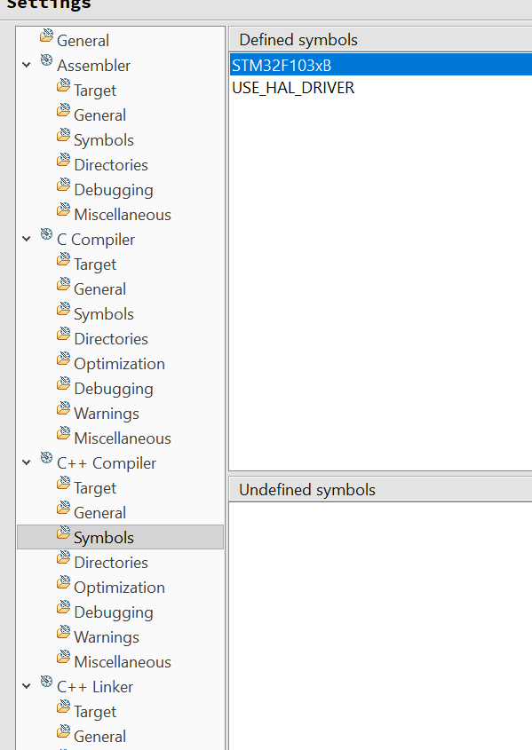
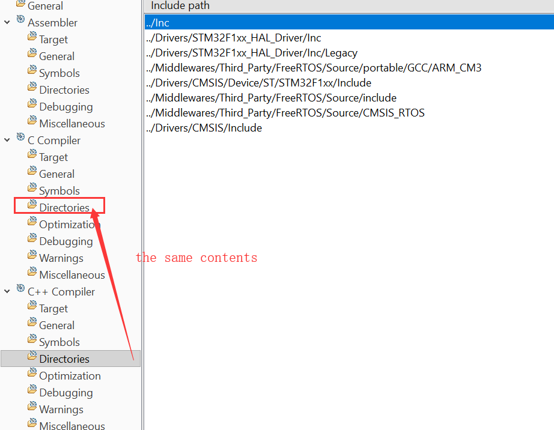
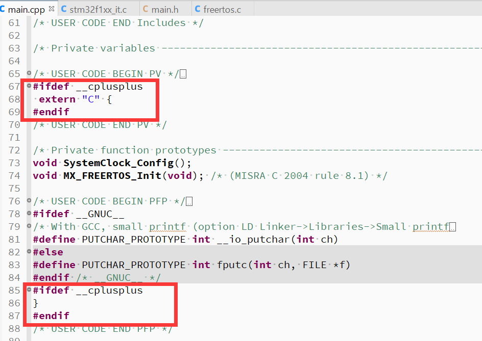

### 转换过程基本是按照下面来的，还有一些小细节

[https://stackoverflow.com/questions/35288808/first-project-for-stm32-with-hal-in-c](https://stackoverflow.com/questions/35288808/first-project-for-stm32-with-hal-in-c)

> How to convert a STM32CubeMX-generated Atollic C project to C++ (3 steps):
>
>  - Copy main.c to main.cpp and 'exclude' main.c from build. Result: Doesn't quite work yet. Although main.cpp might appear in the Eclipse project file list, it doesn't even begin to compile (won't catch obvious syntax errors) and there are linker errors for a missing main(). 
>  - Next, Add org.eclipse.cdt.core.**cc**nature to the .project file with a text editor, like this...
>
>      ```xml
>        <natures>
>      	<nature>org.eclipse.cdt.core.cnature</nature>
>      	<nature>org.eclipse.cdt.core.ccnature</nature>
>      ```
>
>         See [http://www.openstm32.org/forumthread1244][1]. This can be done while Eclipse is running with the project open. Result: main.cpp compiles but it can't find include files because the include paths are wrong. You'd think ***cpp**nature* would have been a better name. 
>        Edit: search Eclipse help for "C++ nature" for tips on how to add C++ nature using  menu File / New / Other / Convert to C/C++ Make Project.
>  - Next, Modify project settings to duplicate pertinent C settings over to C++ settings - as shown here. [![enter image description here][2]][2] The project needs to be closed and re-opened for this change to take effect. Result: builds, links, runs and runs correctly. main.cpp can make calls to HAL c code and HAL callbacks can call functions in .cpp files. An extern "C" modifier may be needed in .cpp files if [1] the .cpp side is calling a function on the .c side (modify function prototypes by pre-pending `defined extern "C"` [2] .c side side is calling a callback defined in a .cpp (modify the function definition on the .cpp side by pre-pending `defined extern "C"`.
>
> Some notes:
>
>  - If I ever re-generate code with CubeMX (e.g., to change a clock or pin-configuration), main.c will get updated but main.cpp will not - so it's necessary to merge changes/diffs from the .c file over to the .cpp file.
>  - How to be certain the C & C++ settings are equivalent: After a build, look at the Console window and compare the command-line invocation for gcc and g++ to make sure pertinent parameters (paths, -D etc) are identical.
>  - It's possible (but risky) to edit the Eclipse .cproject XML file and replicate the C settings over to the C++ side (specific details omitted here - but close project in Eclipse before editing the .cproject file).
>  - Regarding objections to CubeMX/HAL 'bloat': CubeMX generates code and projects very quickly. If a HAL API is slow - e.g., GPIO port-pin access - then simply replace the API call with a new user-function containing a simpler subset of what that bloated API does. I do this frequently in time-critical code.
>  - I'm using CubeMX (4.14.0) and Atollic (v6.0.0 Lite). I didn't see the project option to convert to C++ in the Atollic Eclipse although I have seen that option in other Eclipse environments e.g., Xilinx Eclipse.
>
> Room for improvement: There might be a CubeMX template that could be edited to make these changes more automatic but I don't know enough about CubeMX templates to make this hack more elegant.
>
> I use CubeMX with IAR EWARM too and go through a similar (but slightly easier) process to convert to a .cpp project.
>
> 
>
> [1]: http://www.openstm32.org/forumthread1244
> [2]: https://i.stack.imgur.com/kYHZ3.png

# **下面是细节，注意了蛤（敲黑板）**

- **细节1**
  - 修改完之后，工程要重启来设置c++ compiler的目录和宏定义
  - 
  - 
- **细节2**
  - 如果你使用了FreeRTOS，那么main.cpp是编译不过去的需要一些小改动
  - 