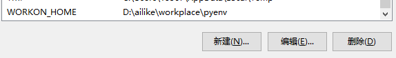
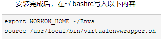

## virtualenv and virtualenvwrapper的使用笔记

> #### virtualenv的使用
>
> - 当前目录创建虚拟环境：`virtualenv venv`
> - 指定python编解释器：`virtualenv -p <path_to_python> venv`
> - 激活环境：`activate venv`
> - 退出环境：`deactivate`
> - 删除环境：`rmvirtualenv venv` or `rm -rf venv`

> #### virtualenvwrapper的使用
>
> - 安装：`pip install virtualenvwrapper-win`
>
> - 创建环境：`mkvirtualenv venv`，默认是在~/Envs创建，更改环境需要设置环境变量，如图
>
>   Linux环境下如下图
>
>   
>
> - 列出环境：`workon`or`lsvirtualenv`
>
> - 激活环境：`workon venv`
>
> - 退出环境：`deactivate`
>
> - 删除环境：`rmvirtualenv venv`
>

